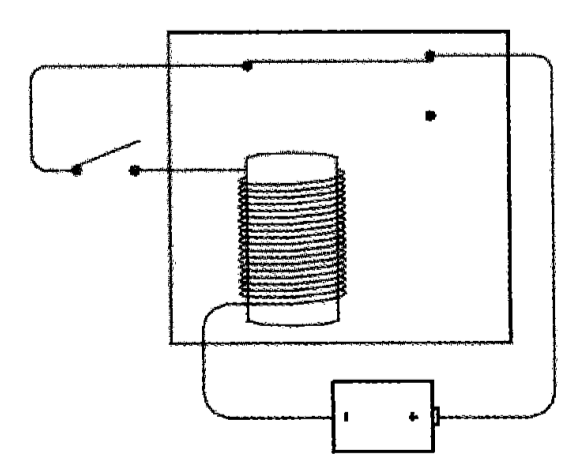
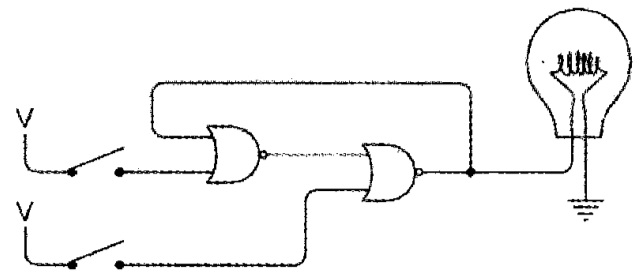
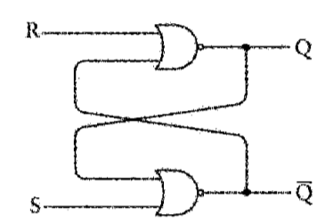
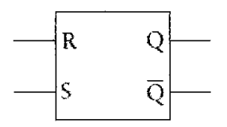
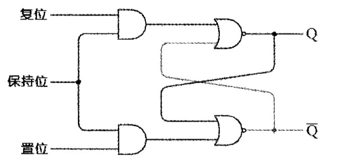
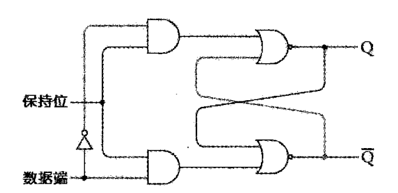
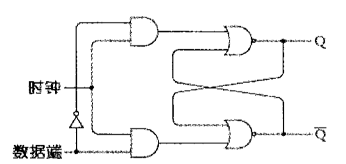
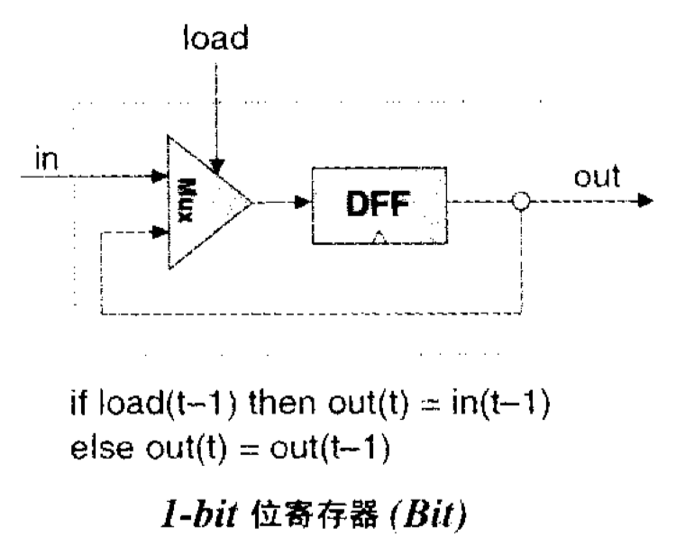

## 第 3 章 时序逻辑

**学习记录**

* `Tue Aug 18 17:18:25 CST 2020`

**1 - 时钟 / 振荡器**

**2 - 反馈电路 / 触发器**

触发器电路可以保持信息，它可以“记住”某些信息

**3 - R-S(Reset-Set, 复位/置位)触发器**

**4 - 电平触发的D型触发器**

> out(t) = in(t-1)

**5 - 寄存器**

> out(t) = out(t-1)

**规范详述**

* [x] D触发器(DFFs)
* [x] 1比特位寄存器(Bit)
* [x] 寄存器(Register)
* [ ] 存储块
* [ ] 计数器芯片